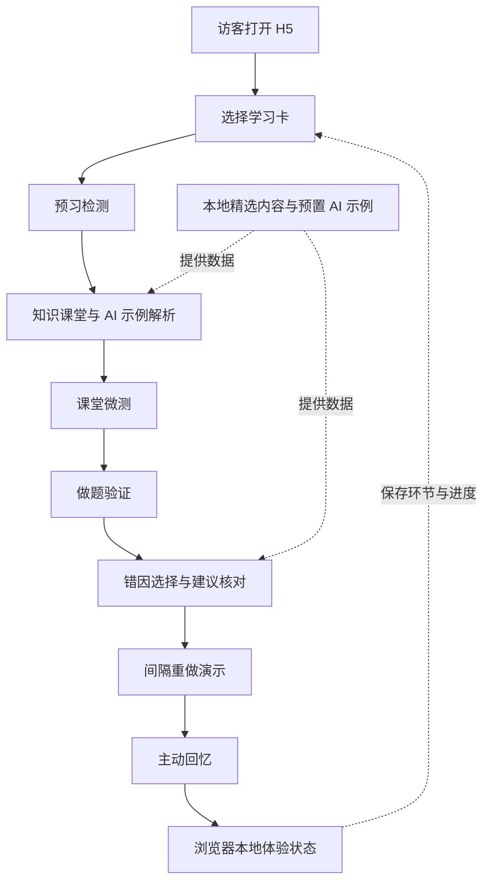

# 架构与实现说明

## 公开演示如何工作

本仓库从医者现有 H5 页面中提取核心学习流程，通过 Web Runtime 在浏览器内运行。页面继续使用 JavaScript、WXML 与 WXSS，演示适配层将页面所需的数据映射为本地示例，体验状态保存在当前浏览器。

演示的重点是检查产品交互和前端实现：同一个知识点如何经过预习、理解、应用、改错和回忆，页面之间怎样衔接，以及用户如何核对 AI 提供的建议。

## 源码阅读路径

| 模块 | 职责 | 源码 |
| --- | --- | --- |
| 公开入口与访问边界 | 启动演示、限制可访问流程与重置体验 | [portfolio-demo.js](../src/services/portfolio-demo.js) |
| 流程适配 | 页面路由、当前步骤、页面需要的示例数据形状 | [onboarding-guide.js](../src/services/onboarding-guide.js) |
| 体验状态 | 初始化、保存当前环节、重新开始与完成 | [product-tour.js](../src/services/product-tour.js) |
| 示例内容 | 学习卡、检测题与预置 AI 输出 | [onboarding-demo-data.js](../src/services/onboarding-demo-data.js) |
| 知识课堂 | 知识内容展示与课堂交互 | [classroom/index.js](../src/pkg-course/classroom/index.js) |
| 错因复盘 | 错因选择、建议编辑与确认 | [wrong-case/index.js](../src/pkg-question/wrong-case/index.js) |
| 浏览器兼容 | 适配小程序运行时行为 | [h5-runtime-adapters.js](../h5-runtime-adapters.js) |

示例内容与流程状态分离，页面通过适配函数获取需要的数据。这让演示可以沿用真实页面，同时保持固定内容、可重复操作和访客之间的数据隔离。

## 完整产品的架构

下表描述医者完整工程的职责分配。公开仓库只包含前端演示部分，不提供下列所有模块的可部署实现。

| 层次 | 技术与职责 |
| --- | --- |
| 微信小程序 | 主要学习入口，承载学习卡、练习、错因复盘和复习等页面 |
| H5 | 基于小程序页面快照与 Web Runtime 的浏览器端适配，完整内测版本有独立身份入口 |
| 管理平台 | Vue、TypeScript 与 Element Plus，提供内容管理与运行状态查看等能力 |
| 业务 API | NestJS 组织认证、内容读取、学习流程与 AI 相关服务 |
| 数据层 | Prisma 与 MySQL，持久化内容、用户私有学习状态和业务记录 |
| 云端服务 | 承载 API、存储和媒体等资源；配置由环境与适配层管理 |

真实产品的 AI 由服务端组织请求并返回完整应答，客户端呈现生成状态和结果。本演示不连接该服务，只使用预置示例展示解析、错因建议和用户确认方式。不能据此推断实时生成质量、生产耗时或线上故障率。

## 静态部署

构建结果是浏览器可访问的静态文件，可由支持静态资源与 HTTPS 的托管服务提供。发布时需要让资源基路径与站点目录一致；页面路由使用 hash，使刷新子页面时仍由同一入口载入。

静态托管负责分发 HTML、JavaScript、样式和演示资源。数据库、实时 AI 与云端身份服务不属于这个演示包。公开源码与文档不包含生产密钥、正式账号、部署凭据或数据库导出。

## 账号迁移边界

产品计划在保持原有腾讯云账号与资源的前提下变更实名主体，并迁入新的小程序账号/AppID。已发布内容库可复用，新端用户身份、学习记录、错题、AI 使用量和个人权益独立起步，不自动合并旧小程序或 H5 内测用户。

本演示没有用户登录或生产身份绑定，其界面与示例可以复用。目标 AppID 登录、接口权限、云资源与媒体可用性仍需在目标账号下分别验收；公开演示能运行不表示迁移验收已经完成。
